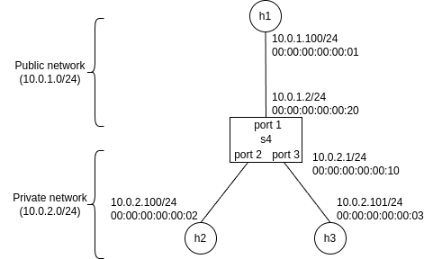

## Prerequisite

You use [OS-Ken](https://github.com/openstack/os-ken) (a fork of [Ryu](https://ryu-sdn.org/)) to implement an OpenFlow controller in
Python and [Mininet](http://mininet.org/) to emulate a network.
In Ubuntu 22.04 VM, install it in the following commands:

`sudo apt-get install mininet python3-os-ken`.

## Specification

Your task is to implement NAT (based on Chapter 4.3.3 Network Address
Translation (NA) of the main textbook) by completing [ nat.py ](./nat.py).
For topology, use the topology described in [ nattopo.py ](./nattopo.py), executing mininet with
```
sudo mn --custom nattopo.py --topo nattopo --mac --controller remote
```
and to start the controller, in another window:
```
osken-manager nat.py
```

Your switch/controller should perform NAT between the private and public networks.
The private network is 10.0.2.0/24 and the public network is 10.0.1.0/24 (we use
another private address subnet for public network simply to avoid confusion in the emulated network).
Three hosts are connecting to the switch, one in the public and the others
in the private network, labelled as `h1`, `h2` and `h3` in Mininet.
Switch is labelled as `s4`.
  

The controller responds to ARP requests as the following (already implemented in
nat.py):
If the request comes from switch port 1, respond with the MAC address of the
public network interface (00:00:00:00:00:20), otherwise with that of the private
network interface (00:00:00:00:00:10).

For simplicity, the controller doesn't have to send ARP requests.
Therefore, assume that the controller knows the MAC address of every host, as
written in the `hostmacs` variable in [ nat.py ](./nat.py).

To create a NAT table entry, simply use the observation of the
first packet in the TCP connection; no need for explicitly matching the packets against SYN flag.

To delete the entry, simply use timeout (please use 10 seconds in submission,
although it is much shorter than 122 seconds recommended by RFC); no need to
match the packets against FIN/RST packets.
Delete just one expired entry whose client port used in the
public network side can be reused by a new entry.
In other words, only at most one expired entry is deleted when creating a new
entry and thus it is possible that one or more expired entries are left after
adding a new entry.

In a completed code, a TCP connection initiated by `h2` to `h1`
looks like following:
```
mininet> h1 tcpdump -w h1.pcap &
mininet> h1 netcat -l 50000 &
mininet> h2 tcpdump -w h2.pcap &
mininet> h2 netcat h1 50000
a
^C
mininet> h1 pkill tcpdump
mininet> h1 pkill netcat
mininet> h2 pkill tcpdump
mininet> h2 tcpdump -nr h2.pcap
reading from file h2.pcap, link-type EN10MB (Ethernet), snapshot length 262144
13:02:42.766703 ARP, Request who-has 10.0.2.1 tell 10.0.2.100, length 28
13:02:42.771158 ARP, Reply 10.0.2.1 is-at 00:00:00:00:00:10, length 46
13:02:42.771172 IP 10.0.2.100.38758 > 10.0.1.100.50000: Flags [S], seq
1891584664, win 42340, options [mss 1460,sackOK,TS val 2252399926 ecr
0,nop,wscale 9], length 0
13:02:42.782823 IP 10.0.1.100.50000 > 10.0.2.100.38758: Flags [S.], seq
2036551763, ack 1891584665, win 43440, options [mss 1460,sackOK,TS val
2154686318 ecr 2252399926,nop,wscale 9], length 0
13:02:42.782888 IP 10.0.2.100.38758 > 10.0.1.100.50000: Flags [.], ack 1, win
83, options [nop,nop,TS val 2252399942 ecr 2154686318], length 0
13:02:45.004217 IP 10.0.2.100.38758 > 10.0.1.100.50000: Flags [P.], seq 1:2, ack
1, win 83, options [nop,nop,TS val 2252402163 ecr 2154686318], length 1
13:02:45.004648 IP 10.0.1.100.50000 > 10.0.2.100.38758: Flags [.], ack 2, win
85, options [nop,nop,TS val 2154688546 ecr 2252402163], length 0

mininet> h1 tcpdump -nr h1.pcap
reading from file h1.pcap, link-type EN10MB (Ethernet), snapshot length 262144
13:02:42.775606 IP 10.0.1.2.1 > 10.0.1.100.50000: Flags [S], seq 1891584664, win
42340, options [mss 1460,sackOK,TS val 2252399926 ecr 0,nop,wscale 9], length 0
13:02:42.775666 ARP, Request who-has 10.0.1.2 tell 10.0.1.100, length 28
13:02:42.778842 ARP, Reply 10.0.1.2 is-at 00:00:00:00:00:20, length 46
13:02:42.778853 IP 10.0.1.100.50000 > 10.0.1.2.1: Flags [S.], seq 2036551763,
ack 1891584665, win 43440, options [mss 1460,sackOK,TS val 2154686318 ecr
2252399926,nop,wscale 9], length 0
13:02:42.783111 IP 10.0.1.2.1 > 10.0.1.100.50000: Flags [.], ack 1, win 83,
options [nop,nop,TS val 2252399942 ecr 2154686318], length 0
13:02:45.004238 IP 10.0.1.2.1 > 10.0.1.100.50000: Flags [P.], seq 1:2, ack 1,
win 83, options [nop,nop,TS val 2252402163 ecr 2154686318], length 1
13:02:45.004282 IP 10.0.1.100.50000 > 10.0.1.2.1: Flags [.], ack 2, win 85,
options [nop,nop,TS val 2154688546 ecr 2252402163], length 0
```
In the client (`h2`) side trace, the source IP address and port of `h2`-to-`h1`
traffic in the connection are 10.0.2.100 and 38758, respectively, whereas those are 10.0.1.2 and 1 at the server (`h3`) side trace.

## Marking Criteria

1. [nat.py](./nat.py) can mediate one TCP connection initiated by `h2` or `h3` towards `h1` while applying NAT.
Appropriate flow must be installed to the switch so that every data packet is not redirected to the controller (**25%**):

2. [nat.py](./nat.py) can reuse the client TCP port used at the public network side in the expired NAT table entry when creating a new entry (**25%**)

3. [nat.py](./nat.py) can send a RST packet to the client when the NAT table is full (**25%**)

4. [nat.py](./nat.py) can support simultaneous 65000 active connections per server address/port (**25%**)
